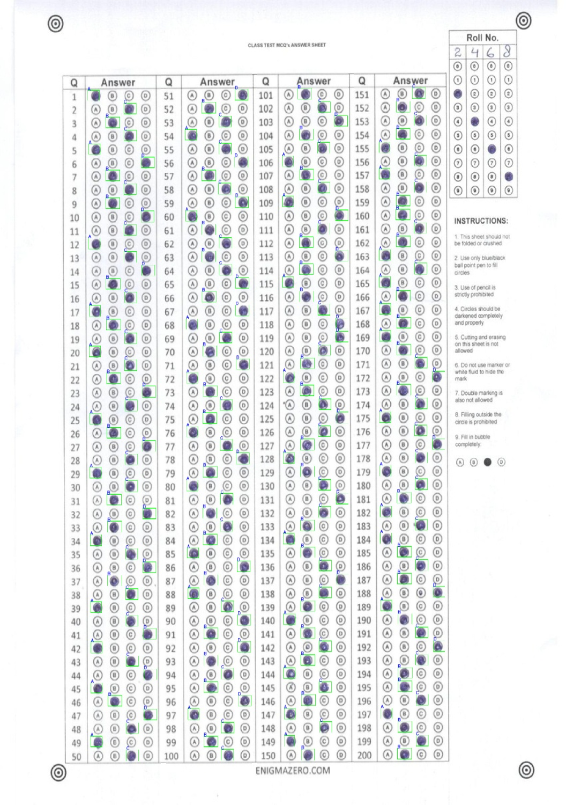
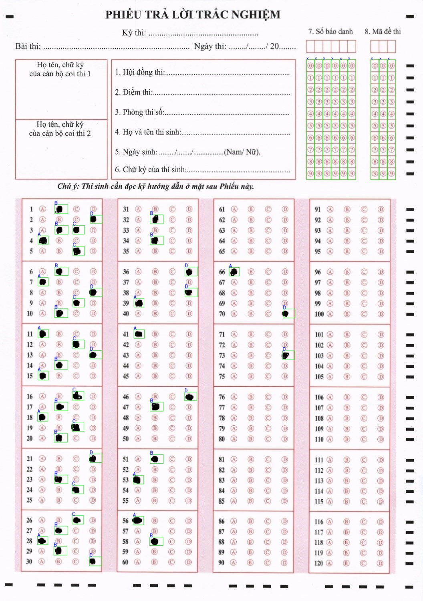

# Comparison with Other OMR Systems

To evaluate the robustness, accuracy, and efficiency of our system, we conducted comparative evaluations against two popular open-source Optical Mark Recognition (OMR) systems:

1. **OMRChecker** ([Udayraj123/OMRChecker](https://github.com/Udayraj123/OMRChecker)) - A highly popular general-purpose OMR system (>1k stars on GitHub).
2. **Auto-Scores-National-Multiple-Choice-Test** ([buiquangmanhhp1999/Auto-Scores-National-Multiple-Choice-Test](https://github.com/buiquangmanhhp1999/Auto-Scores-National-Multiple-Choice-Test)) - A specialized OMR system for Vietnamese national high school exam templates using traditional CNN classifiers (explained in detail in this [Viblo article](https://viblo.asia/p/cham-diem-de-thi-trac-nghiem-quoc-gia-bang-opencv-ByEZk2ooKQ0)).

We ran our trained model directly on their datasets (scanned sheets/photographed sheets) to verify the adaptability of our deep-learning-based scoring pipeline.

---

## 1. Evaluation on External Datasets

### A. OMRChecker Dataset

- **Test Image**: [omrchecker_sample.jpg](docs/omrchecker_sample.jpg) (from the OMRChecker repository)
- **Configuration**: 200 questions (4 columns × 50 questions)
- **Result**: Our system successfully corrected the alignment and predicted all 200 questions correctly.
- **Annotated Output**:

_(See file: [omrchecker_result.jpg](docs/omrchecker_result.jpg))_

### B. Auto-Scores-National-Multiple-Choice-Test Dataset

- **Test Image**: [autoscores_sample.jpg](docs/autoscores_sample.jpg) (from the Auto-Scores repository)
- **Configuration**: 120 questions (4 columns × 30 questions)
- **Result**: Our system successfully detected alignment markers, corrected the perspective, and scored all 120 questions.
- **Annotated Output**:

_(See file: [autoscores_result.jpg](docs/autoscores_result.jpg))_

---

## 2. Comparative Analysis (Strengths & Weaknesses)

Below is a detailed comparison of our system against the two baseline systems.

### Comparison Table

| Metric / Aspect                    | OMRChecker                                                     | Auto-Scores-National-Multiple-Choice-Test                                                      | **Our System (YOLO-based)**                                                                                  |
| :--------------------------------- | :------------------------------------------------------------- | :--------------------------------------------------------------------------------------------- | :----------------------------------------------------------------------------------------------------------- |
| **Core Method**                    | Traditional CV (Contours, template matching)                   | Traditional CV + CNN classifier (crops individual bubbles)                                     | Deep Learning (YOLOv8/v11 marker, digit, & answer detection)                                                 |
| **Accuracy (Mobile/Camera data)**  | ~90% (Prone to perspective & lighting distortion)              | Moderate (Relies on precise traditional CV alignment before CNN classification)                | **99.6%** (Highly robust to perspective, skew, and lighting)                                                 |
| **Processing Speed**               | **Very Fast** (Milliseconds)                                   | Slower (Significant overhead from cropping and classifying _every single bubble_ sequentially) | **Fast & Balanced** (Processes columns/zones holistically via YOLO)                                          |
| **Multi-Answer & Blank Detection** | Basic (relies on intensity thresholding per bubble)            | Basic (binary classification of cropped bubbles)                                               | **Native Multi-Class** (Supports combinations from `0000` to `1111` in a single pass)                        |
| **Auto-Orientation Correction**    | ❌ None (Requires manual alignment before running)             | ❌ None (Requires manual alignment before running)                                             | **✅ Fully Automatic** (Detects asymmetric marker layout to auto-rotate 90/180/270 degrees)                  |
| **Built-in QA & Human Inspection** | ❌ None (No confidence flagging)                               | ❌ None (No confidence flagging)                                                               | **✅ Smart Warn Log** (Detects muddled/low-confidence marks, alerts via warning log & orange bounding boxes) |
| **Flexibility / Setup Overhead**   | High (Requires pixel-by-pixel coordinate mapping per template) | Very High (Hardcoded template geometry)                                                        | **Low** (Adaptive layout config based on simple parameters like `numberAnswer`)                              |

---

### Key Takeaways & Discussion

#### 1. Ours vs. OMRChecker

- **Accuracy & Robustness**:
  - **OMRChecker** relies on traditional contour detection and thresholding. While highly optimized, it struggles significantly with mobile camera photos due to lighting variance, shadows, page curvature, and perspective distortion. The reported accuracy drops to around **90%** for real-world mobile-captured sheets.
  - **Our System** leverages deep learning (YOLO) for robust marker detection. Using homography perspective transformation, it corrects highly distorted sheets, achieving an accuracy of **99.6%** even on mobile phone captures.
- **Execution Time**:
  - **OMRChecker** is faster because it does not run heavy deep-learning model inference.
  - **Our System** introduces inference overhead due to the YOLO model, but this is a reasonable trade-off to ensure near-perfect grading accuracy, which is critical for high-stakes exams.
- **Layout Design & Setup**:
  - **OMRChecker** requires writing a complex JSON coordinate mapping template for every single bubble on the sheet, which is tedious and error-prone.
  - **Our System** combines dynamic crop-and-detect. It automatically partitions the layout into columns based on simple config parameters, making it far more scalable to adapt to different layouts without mapping hundreds of individual coordinates.

#### 2. Ours vs. Auto-Scores-National-Multiple-Choice-Test

- **Efficiency, Speed, & Input Constraints**:
  - The **Auto-Scores** system imposes very strict input regulations: the input images must be scanned documents (free from camera skew, shadows, or perspective warping) and must be uploaded in the correct orientation. It fails completely under sideways or upside-down orientations as it lacks auto-rotation. Furthermore, it crops _every single option bubble_ (e.g., A, B, C, D for 120 questions = 480 small cropped images) and runs a CNN classification on each sequentially, leading to high processing overhead.
  - **Our System** accepts hand-captured mobile photos, auto-detects and corrects rotation skews up to 360°, and detects selected answers in a single YOLO forward pass on columns/zones without cropping individual bubbles. This results in a much faster, more robust, and more scalable grading pipeline.

---

### 3. Key Competitive Advantages of Our Pipeline

- **Native Multi-Choice Support**: Traditional OMR pipelines classify single bubbles (marked/unmarked), failing on multiple choices or poor erasures. Our YOLO model treats combinations natively (`0000` to `1111`), recognizing multi-answers (e.g., `0011` for A & B) in a single bounding box prediction.
- **Asymmetric 360° Auto-Orientation**: While baselines require manually oriented scans, our system uses an asymmetric marker layout (3x `marker1`, 1x `marker2`). It automatically detects and corrects rotation (90°/180°/270°) and skew before perspective transformation.
- **Built-in Quality Assurance (Low-Confidence Alert)**: Low-confidence predictions (below `threshold_warning = 0.79`) are flagged in `MayBeWrong/maybe_wrong.txt` and highlighted with an **orange box** on the output image, facilitating quick manual review and preventing silent grading errors.
