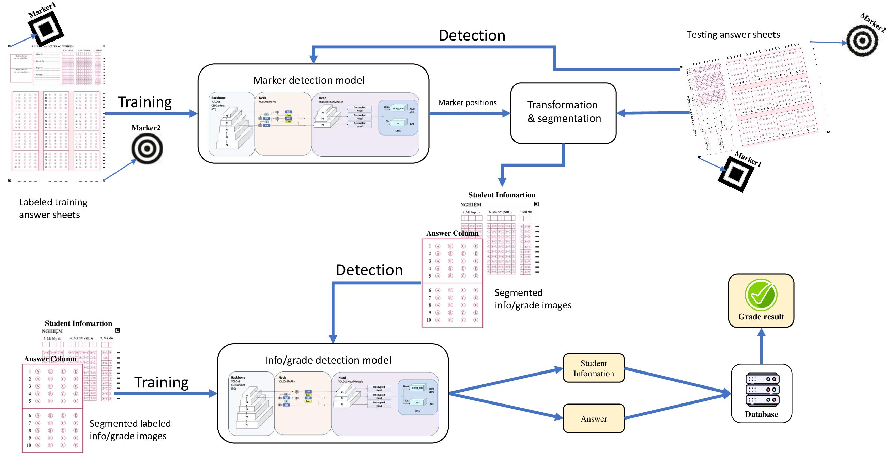
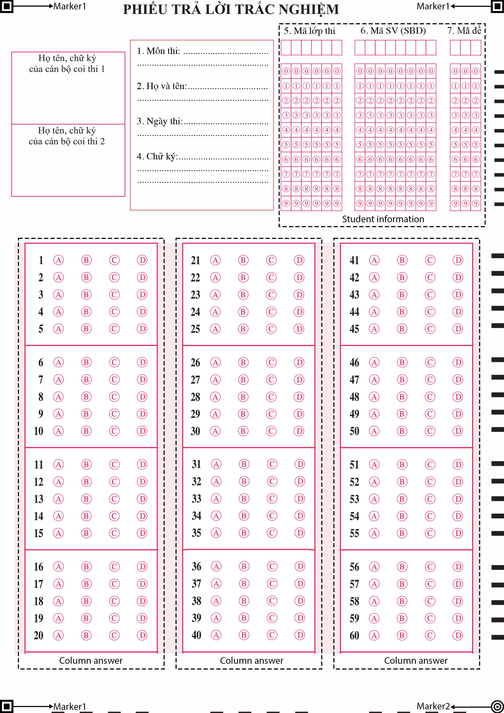

# Paper-Based MCQ Scoring System

[](https://www.python.org/)
[](LICENSE)
[]()
[](https://docs.ultralytics.com/vi/models/yolo11/)
[](https://doi.org/10.5281/zenodo.18816315)

An automated optical scoring system for paper-based multiple-choice question (MCQ) answer sheets. The system uses computer vision and deep learning (YOLOv11) to detect alignment markers, extract student/exam information, and recognize selected answers from scanned or photographed answer sheet images — producing structured JSON output suitable for downstream grading pipelines.

---

## Table of Contents

- [Overview](#overview)
- [Versioning](#versioning)
- [Features](#features)
- [System Architecture](#system-architecture)
- [Requirements](#requirements)
- [Installation](#installation)
- [Directory Structure](#directory-structure)
- [Answer Sheet Template](#answer-sheet-template)
- [Usage](#usage)
  - [Preparing Input Images](#preparing-input-images)
  - [Running the Scoring Pipeline](#running-the-scoring-pipeline)
  - [Output Description](#output-description)
- [Models](#models)
- [Grading With Answer Key](#grading-with-answer-key)
- [Configuration](#configuration)
- [Dataset](#dataset)
- [License](#license)

---

## Overview

This system automates the grading of paper-based MCQ exams. Given a folder of answer sheet images (JPEG or PNG), it:

1. **Detects alignment markers** on the answer sheet to correct skew and perspective.
2. **Extracts student information** (class code, student code, exam/test-set code) from the information zone.
3. **Recognizes selected answers** for each question (supporting up to 60 questions per sheet with multi-answer combinations A, B, C, D, AB, AC, …, ABCD).
4. **Writes annotated output images** and structured **JSON result files** per answer sheet.
5. **Logs potentially uncertain predictions** (low-confidence detections) to a warning file.

The pipeline is designed for integration with an e-learning support platform but can also be used as a standalone batch-processing tool.

---

## Versioning

This repository maintains **two branches** corresponding to two distinct implementations:

| Branch                     | Detector | Model strategy                    | Description                                                   |
| -------------------------- | -------- | --------------------------------- | ------------------------------------------------------------- |
| `yolov8` _(paper version)_ | yolov8m  | Single shared model               | As described in the published paper (Tinh & Minh, 2024)       |
| `main` _(this branch)_     | YOLOv11m | Three separate specialized models | Upgraded implementation with improved accuracy and modularity |

### Differences from the Published Paper Version

#### 1. Object Detector: YOLOv8 → YOLOv11

The published paper used **YOLOv8** (released January 2023, Ultralytics). This branch upgrades to **YOLOv11** (released September 2024, Ultralytics), which introduces architectural refinements — particularly the **C3k2** block and **PSAA (Partial Self-Attention Aggregation)** mechanism — resulting in higher accuracy with fewer parameters.

**Comparison of the medium (m) variants used in this project:**

| Metric                             | YOLOv8m | YOLOv11m | Change      |
| ---------------------------------- | ------- | -------- | ----------- |
| Parameters                         | 25.9 M  | 20.1 M   | **−22.4%**  |
| Inference speed (T4 TensorRT FP16) | 5.86 ms | 4.70 ms  | **−19.8%**  |
| COCO mAP50-95                      | 50.2    | 51.5     | **+1.3 pp** |
| FLOPs                              | 78.9 B  | 68.0 B   | **−13.8%**  |

> Source: [Ultralytics YOLOv11 documentation](https://docs.ultralytics.com/models/yolo11/)

In this domain-specific application (answer sheet detection), YOLOv11 achieves higher detection accuracy with a smaller model footprint, making it better suited for deployment.

#### 2. Model Architecture: Single Model → Three Specialized Models

The **paper version** (`yolov8` branch) uses a **single YOLOv8 model** trained on all detection tasks simultaneously (markers, student info digits, and answer bubbles). While this reduces the number of model files to maintain, it requires the model to generalize across visually very different object types.

The **current version** (`main` branch) separates the detection into **three independent specialized models**, each trained exclusively on its own task:

| Model       | Task                                  | Benefit of specialization                      |
| ----------- | ------------------------------------- | ---------------------------------------------- |
| `marker.pt` | Alignment marker detection            | Higher recall on small corner markers          |
| `info.pt`   | Student information digit recognition | Better digit discrimination in dense grids     |
| `answer.pt` | Answer bubble classification          | Improved accuracy on multi-choice combinations |

This specialization allows each model to be fine-tuned independently and retrained without affecting the other tasks, improving both accuracy and maintainability.

---

## Features

- ✅ Automatic perspective correction using marker-based homography
- ✅ Supports 20, 40, and 60 question answer sheets
- ✅ Multi-answer recognition (single and combination choices: AB, AC, AD, BC, BD, CD, ABC, ABD, ACD, BCD, ABCD)
- ✅ Student information zone OCR (class code, student ID, test-set code)
- ✅ Confidence-based warning system for low-certainty predictions
- ✅ JSON output format for easy downstream integration
- ✅ Annotated output images highlighting detected answers

---

## System Architecture



**Key modules:**

| File                               | Description                                                                                     |
| ---------------------------------- | ----------------------------------------------------------------------------------------------- |
| `scoring.py`                       | Main pipeline: marker detection, image alignment, info/answer prediction, output writing        |
| `utils.py`                         | All utilities: geometry, perspective transform, angle calculation, class mapping, image helpers |
| `grade_from_key/grade_from_key.py` | Standalone grading script: compare scored sheets against an answer key file                     |

---

## Requirements

- Python **3.8** or higher
- The following Python packages (see also `requirements.txt`):

| Package                  | Version  | Purpose                           |
| ------------------------ | -------- | --------------------------------- |
| `opencv-python-headless` | 4.9.0.80 | Image processing                  |
| `ultralytics`            | ≥ 8.3    | YOLOv11 model inference           |
| `numpy`                  | ≥ 1.21   | Numerical operations              |
| `Flask`                  | latest   | (Optional) REST API serving       |
| `uwsgi`                  | latest   | (Optional) Production WSGI server |

> **Note:** `Flask` and `uwsgi` are only required if you are deploying the system as a web service. For standalone batch processing, only `opencv-python-headless`, `ultralytics`, and `numpy` are needed.

---

## Installation

### 1. Clone the repository

```bash
git clone https://github.com/<your-username>/paper-based-mcq-scoring.git
cd paper-based-mcq-scoring
```

### 2. Create and activate a virtual environment (recommended)

```bash
python -m venv venv

# On Linux/macOS:
source venv/bin/activate

# On Windows:
venv\Scripts\activate
```

### 3. Install dependencies

```bash
pip install -r requirements.txt
pip install ultralytics numpy
```

### 4. Verify model files

Ensure the three YOLOv11 model weight files are present in the `Model/` directory:

```
Model/
├── marker.pt      # Alignment marker detector (~5.2 MB)
├── info.pt        # Student information recognizer (~38.6 MB)
└── answer.pt      # Answer choice recognizer (~38.6 MB)
```

> The model files are **not** included in this repository due to their size. Please contact the authors or download them from the provided release assets.

---

## Directory Structure

```
paper-based-mcq-scoring/
│
├── Model/                          # Pre-trained YOLOv11 weights
│   ├── marker.pt
│   ├── info.pt
│   └── answer.pt
│
├── images/
│   └── answer_sheets/
│       └── <exam_class_id>/        # One folder per exam session
│           ├── 1.jpg               # Input answer sheet images
│           ├── 2.jpg
│           ├── ...
│           ├── HandledSheets/      # (auto-created) Annotated output images
│           ├── ScoredSheets/       # (auto-created) JSON result files
│           └── MayBeWrong/         # (auto-created) Low-confidence warning log
│
├── scoring.py                      # Main scoring pipeline
├── utils.py                        # All utility functions (geometry, labels, image helpers)
├── grade_from_key/                 # Grading module
│   ├── grade_from_key.py           # Script: compare scored sheets against answer key
│   ├── answer_key.json             # Answer key (fill in correct answers per exam set)
│   └── grading_report.json         # (auto-generated) Grading output report
├── docs/                           # Documentation assets
│   ├── AnswerSheetTemplate.pdf     # Printable answer sheet template
│   ├── AnswerSheetTemplate.png     # Answer sheet template image
│   └── StructureDiagram.png        # System architecture diagram
├── requirements.txt
└── README.md
```

---

## Answer Sheet Template

The file `docs/AnswerSheetTemplate.pdf` is the official printable template that this system is designed to process. Print it on **A4 paper** before scanning or photographing.



### Printing Notes

- Print at **100% scale** on **A4 (210 × 297 mm)** — do **not** scale to fit
- Use a **laser printer** for best marker contrast
- Ensure all 4 alignment markers are fully printed and not clipped by the page margin

---

## Usage

### Preparing Input Images

1. Create a folder named after the **exam class ID** inside `images/answer_sheets/`:

```bash
mkdir -p images/answer_sheets/<exam_class_id>
```

2. Place all scanned or photographed answer sheet images (`.jpg`, `.jpeg`, or `.png`) inside that folder.

**Image requirements:**

- The answer sheet must contain **4 alignment markers** (3 × `marker1` at top-left, top-right, bottom-left; 1 × `marker2` at bottom-right).
- Recommended image resolution: **≥ 1056 × 1500 px**.
- Supported formats: `JPEG`, `PNG`.

---

### Running the Scoring Pipeline

Run the main script from the project root, passing the exam class folder name as the argument:

```bash
python scoring.py <exam_class_id>
```

**Example:**

```bash
python scoring.py demo1
```

This will process all images inside `images/answer_sheets/demo1/` and write results to the automatically created subdirectories.

---

### Output Description

For each successfully processed answer sheet image (e.g., `1.jpg`), the system produces:

#### 1. JSON Result File — `ScoredSheets/<filename>_data.json`

```json
{
  "examClassCode": "demo1",
  "studentCode": "026983557",
  "testSetCode": "014",
  "answers": [
    { "questionNo": 1, "selectedAnswers": "A" },
    { "questionNo": 2, "selectedAnswers": "BC" },
    { "questionNo": 3, "selectedAnswers": "" },
    ...
    { "questionNo": 60, "selectedAnswers": "D" }
  ],
  "handledScoredImg": "images/answer_sheets/demo1/HandledSheets/handled_1.jpg",
  "originalImg": "images/answer_sheets/demo1/1.jpg",
  "originalImgFileName": "1.jpg"
}
```

| Field                       | Type      | Description                                                                                               |
| --------------------------- | --------- | --------------------------------------------------------------------------------------------------------- |
| `examClassCode`             | `string`  | Detected class/course code from the info zone                                                             |
| `studentCode`               | `string`  | Detected student ID number                                                                                |
| `testSetCode`               | `string`  | Detected test/exam set code                                                                               |
| `answers`                   | `array`   | List of per-question answer objects                                                                       |
| `answers[].questionNo`      | `integer` | Question number (1-indexed)                                                                               |
| `answers[].selectedAnswers` | `string`  | Selected answer(s): `"A"`, `"B"`, `"C"`, `"D"`, combinations like `"AB"`, `"BCD"`, or `""` for unanswered |
| `handledScoredImg`          | `string`  | Path to the annotated output image                                                                        |
| `originalImg`               | `string`  | Path to the original input image                                                                          |
| `originalImgFileName`       | `string`  | File name of the original input image                                                                     |

#### 2. Annotated Image — `HandledSheets/handled_<filename>.<ext>`

A copy of the answer sheet with colored bounding boxes drawn over detected answers:

- 🟢 **Green box**: high-confidence prediction
- 🟠 **Orange box**: low-confidence prediction (also logged to warning file)

#### 3. Warning Log — `MayBeWrong/may_be_wrong.txt`

If any detection has a confidence score below the threshold (`0.79` by default), a line is appended:

```
[LOW CONF] Answer zone | File: 1.jpg | Question 5 | Predicted: "A" | Conf: 0.71
[LOW CONF] Info zone   | File: 1.jpg | Column 4 (left→right) | Predicted: "" | Conf: 0.68
```

Each record is a single line with `|`-separated fields: zone type, filename, location, predicted label, and confidence score.

---

## Grading With Answer Key

After scoring, use the grading module to compare detected answers against the answer key and compute each student's score.

📄 **Full instructions → [`grade_from_key/README.md`](grade_from_key/README.md)**

**Quick start:**

```bash
# 1. Fill in the correct answers per exam set code
nano grade_from_key/answer_key.json

# 2. Run the grading script
python3 grade_from_key/grade_from_key.py <exam_class_id>
```

Output is printed to the console and saved to `grade_from_key/grading_report.json`.

---

## Models

This branch uses three custom-trained **YOLOv11** object detection models, one dedicated per task:

| Model file  | Task                         | Input region                    | Output classes                                                                                                                 |
| ----------- | ---------------------------- | ------------------------------- | ------------------------------------------------------------------------------------------------------------------------------ |
| `marker.pt` | Alignment marker detection   | Full answer sheet image         | `marker1` (×3, at TL/TR/BL), `marker2` (×1, at BR)                                                                             |
| `info.pt`   | Student info zone OCR        | Cropped info zone (640×640)     | `0`–`9`, `unchoice` (uncircled/blank)                                                                                          |
| `answer.pt` | Answer bubble classification | Cropped answer column (250×640) | `0000`, `0001`, `0010`, `0011`, `0100`, `0101`, `0110`, `0111`, `1000`, `1001`, `1010`, `1011`, `1100`, `1101`, `1110`, `1111` |

All three models are based on the **YOLOv11m** (nano) architecture, trained on a custom dataset of Vietnamese university MCQ answer sheets.

> For the original single-model implementation as described in the published paper, refer to the `yolov8` branch.

---

## Configuration

Key parameters that can be adjusted directly in the source files:

| Parameter           | Location                  | Default             | Description                                                           |
| ------------------- | ------------------------- | ------------------- | --------------------------------------------------------------------- |
| `threshold_warning` | `utils.py`                | `0.79`              | Confidence threshold below which a prediction is flagged as uncertain |
| `numberAnswer`      | `scoring.py` (main block) | `60`                | Number of questions per answer sheet (supported: `20`, `40`, `60`)    |
| `pWeight_marker`    | `scoring.py`              | `./Model/marker.pt` | Path to the marker detection model                                    |
| `pWeight_info`      | `scoring.py`              | `./Model/info.pt`   | Path to the info recognition model                                    |
| `pWeight_answer`    | `scoring.py`              | `./Model/answer.pt` | Path to the answer recognition model                                  |

---

## Dataset

The training and evaluation dataset for this system is publicly available on Zenodo:

[](https://doi.org/10.5281/zenodo.18816315)

**Dataset:** [https://doi.org/10.5281/zenodo.18816315](https://doi.org/10.5281/zenodo.18816315)

The dataset contains labelled answer sheet images used to train and evaluate the YOLOv11 models for marker detection, student info recognition, and answer bubble classification.

---

## License

This project is licensed under the **MIT License**.

```
MIT License

Copyright (c) 2024 The Authors

Permission is hereby granted, free of charge, to any person obtaining a copy
of this software and associated documentation files (the "Software"), to deal
in the Software without restriction, including without limitation the rights
to use, copy, modify, merge, publish, distribute, sublicense, and/or sell
copies of the Software, and to permit persons to whom the Software is
furnished to do so, subject to the following conditions:

The above copyright notice and this permission notice shall be included in
all copies or substantial portions of the Software.

THE SOFTWARE IS PROVIDED "AS IS", WITHOUT WARRANTY OF ANY KIND, EXPRESS OR
IMPLIED, INCLUDING BUT NOT LIMITED TO THE WARRANTIES OF MERCHANTABILITY,
FITNESS FOR A PARTICULAR PURPOSE AND NONINFRINGEMENT. IN NO EVENT SHALL THE
AUTHORS OR COPYRIGHT HOLDERS BE LIABLE FOR ANY CLAIM, DAMAGES OR OTHER
LIABILITY, WHETHER IN AN ACTION OF CONTRACT, TORT OR OTHERWISE, ARISING FROM,
OUT OF OR IN CONNECTION WITH THE SOFTWARE OR THE USE OR OTHER DEALINGS IN THE
SOFTWARE.
```

---

## Citation

This software is based on the following peer-reviewed publication. If you use this system in academic work, please cite:

**Pham Doan Tinh and Ta Quang Minh**, "Automated Paper-based Multiple Choice Scoring Framework using Fast Object Detection Algorithm," _International Journal of Advanced Computer Science and Applications (IJACSA)_, vol. 15, no. 1, 2024. DOI: [10.14569/IJACSA.2024.01501115](http://dx.doi.org/10.14569/IJACSA.2024.01501115)

```bibtex
@article{Tinh2024,
  title     = {Automated Paper-based Multiple Choice Scoring Framework using Fast Object Detection Algorithm},
  journal   = {International Journal of Advanced Computer Science and Applications},
  doi       = {10.14569/IJACSA.2024.01501115},
  url       = {http://dx.doi.org/10.14569/IJACSA.2024.01501115},
  year      = {2024},
  publisher = {The Science and Information Organization},
  volume    = {15},
  number    = {1},
  author    = {Pham Doan Tinh and Ta Quang Minh}
}
```

---

## Contact

For questions, issues, or contributions, please open a GitHub Issue or contact the authors:

- **Pham Doan Tinh** — corresponding author
- **Ta Quang Minh** - Email: taminh596@gmail.com - Phone: +84 979047751

Paper available at: [https://thesai.org/Publications/ViewPaper?Volume=15&Issue=1&Code=IJACSA&SerialNo=115](https://thesai.org/Publications/ViewPaper?Volume=15&Issue=1&Code=IJACSA&SerialNo=115)
