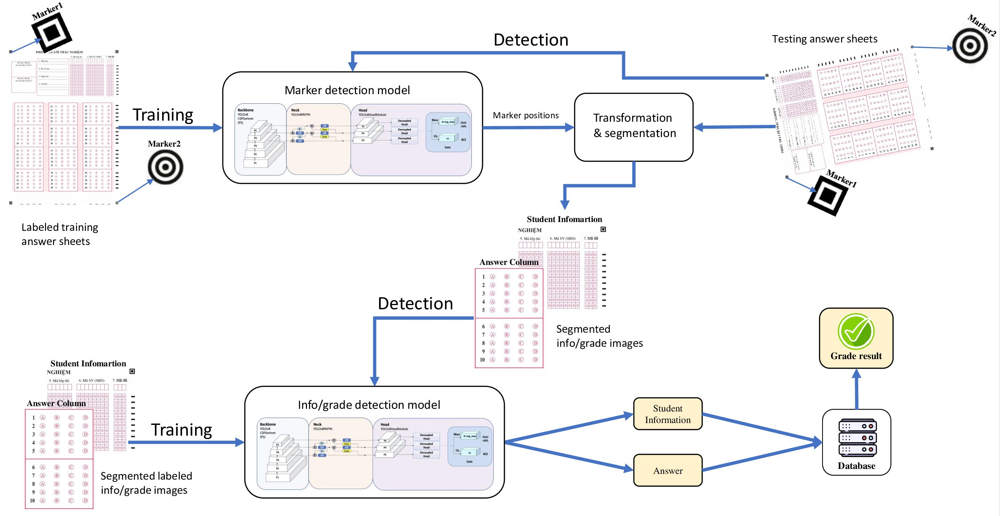
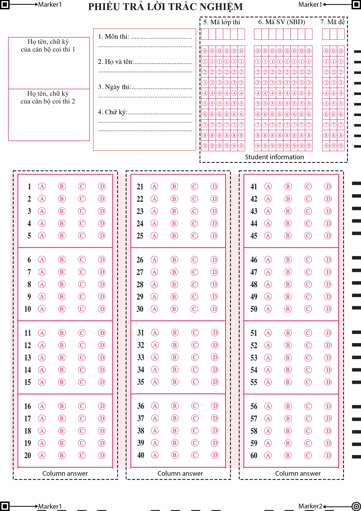

# Paper-Based MCQ Scoring System

[](https://www.python.org/)
[](<[LICENSE](https://github.com/phamdoantinh/paperbasedmcqscoring/blob/main/LICENSE)>)
[](https://opencv.org/)
[](https://docs.ultralytics.com/models/yolov8/)

> **This is the `main` branch — the original YOLOv8 implementation as described in the published paper.**
> A newer version using YOLOv11 and three separate specialized models is available on the [`yolov11-version`](../../tree/yolov11-version) branch.

An automated optical scoring system for paper-based multiple-choice question (MCQ) answer sheets. The system uses computer vision and deep learning (YOLOv8) to detect alignment markers, extract student/exam information, and recognize selected answers from scanned or photographed answer sheet images — producing structured JSON output suitable for downstream grading pipelines.

---

## Table of Contents

- [Feature & Overview](#feature-overview)
- [Reproducibility](#reproducibility)
- [System Architecture](#system-architecture)
- [Directory Structure](#directory-structure)
- [Answer Sheet Template](#answer-sheet-template)
- [Requirements & Installation](#requirements--installation)
- [Usage](#usage)
- [Models](#models)
- [Configuration](#configuration)
- [Dataset](#dataset)
- [Citation](#citation)
- [License](#license)
- [Contact](#contact)

---

## Features & Overview

This system automates the grading of paper-based MCQ exams. Given a folder of answer sheet images (JPEG or PNG), it provides the following capabilities:

- ✅ **Perspective Correction**: Automatic skew and perspective correction using marker-based homography.
- ✅ **Student Info OCR**: Automatically extracts class code, student ID, and test-set code from the info zone.
- ✅ **Flexible Grading**: Supports 20, 40, and 60 question answer sheets with single and multi-answer (A, B, C, D combinations) recognition.
- ✅ **Comprehensive Output**: Generates annotated images highlighting detected answers and structured JSON result files.
- ✅ **Quality Assurance**: Logs potentially uncertain predictions (low-confidence detections) to a warning file for verification.
- ✅ **Standalone or Integrated**: Suitable for batch processing or integration with e-learning support platforms.

---

## Reproducibility

> 📄 **Full step-by-step guide → [`REPRODUCE.md`](REPRODUCE.md)**

The following resources are **included in this repository** to allow direct reproduction of the reported results:

| Resource                  | Path                         | Description                                             |
| ------------------------- | ---------------------------- | ------------------------------------------------------- |
| Pretrained model weights  | `Model/best.pt`              | Fine-tuned YOLOv8m detector (~52 MB) — **included**     |
| Sample answer sheets      | `images/demo1/`              | 10 real scanned answer sheet images                     |
| Sample grading data       | `grade_from_key/`            | Answer key and expected grading report for `demo1`      |
| Expected scored output    | `images/demo1/ScoredSheets/` | Pre-computed JSON result per sheet                      |
| Grading demo (standalone) | `example_grading/`           | Self-contained grading example — no model/images needed |

**Option A — Test the grading module only (no model or images required):**

```bash
python3 example_grading/run_grading.py
```

Uses pre-scored JSON files already in `example_grading/scored_sheets/` and auto-verifies against `example_grading/expected_output.json`. Only Python standard library needed.

**Option B — Full pipeline (scoring + grading):**

```bash
pip install -r requirements.txt && pip install ultralytics
python3 scoring.py demo1
python3 grade_from_key/grade_from_key.py demo1
```

The answer key for all exam sets in `demo1` is pre-filled. Compare output with the included `grade_from_key/grading_report.json` to verify correctness.

---

## System Architecture



**Key modules:**

| File                               | Description                                                                                     |
| ---------------------------------- | ----------------------------------------------------------------------------------------------- |
| `scoring.py`                       | Main pipeline: marker detection, image alignment, info/answer prediction, output writing        |
| `utils.py`                         | All utilities: geometry, perspective transform, angle calculation, class mapping, image helpers |
| `grade_from_key/grade_from_key.py` | Standalone grading script: compare scored sheets against an answer key file                     |
| `example_grading/run_grading.py`   | Example script to show how to use the `grade_from_key` module                                   |

---

## Directory Structure

```
paperbasedmcqscoring/
│
├── Model/
│   └── best.pt                         # Weights of model (all tasks)
│
├── images/
│   ├── demo1/                              # One folder per exam session
│   │   ├── 1.jpg                   # Input answer sheet images
│   │   ├── HandledSheets/          # (auto-created) Annotated output images
│   │   ├── ScoredSheets/           # (auto-created) JSON result files
│   │   └── MayBeWrong/             # (auto-created) Low-confidence warning log
│   └── demo2/
│
├── scoring.py                          # Main scoring pipeline
├── utils.py                            # All utility functions
├── grade_from_key/
│   ├── grade_from_key.py               # Grading script
│   ├── answer_key.json                 # Answer key (pre-filled for demo1)
│   └── grading_report.json             # Expected output (auto-generated)
├── docs/                               # Documentation assets
│   ├── AnswerSheetTemplate.pdf         # Printable answer sheet template
│   ├── AnswerSheetTemplate.png
│   └── StructureDiagram.png
├── REPRODUCE.md                        # Step-by-step reproducibility guide
├── example_grading/                    # Zero-dependency grading demo
│   ├── run_grading.py                  # Demo execution script
│   ├── answer_key.json                 # Sample answer key for demo
│   ├── expected_output.json            # Reference report for verification
│   ├── grading_output.json             # (auto-created) Demo output report
│   └── scored_sheets/                  # Pre-scored JSON data files
├── requirements.txt
└── README.md
```

---

## Answer Sheet Template

The file `docs/AnswerSheetTemplate.pdf` is the official printable template that this system is designed to process. Print it on **A4 paper** before scanning or photographing.



**Printing notes:** Print at **100% scale** on **A4 (210 × 297 mm)** — do **not** scale to fit. Use a laser printer for best marker contrast. Ensure all 4 alignment markers are fully printed and not clipped.

---

## Requirements & Installation

- Python **3.8** or higher

| Package                  | Version  | Purpose                |
| ------------------------ | -------- | ---------------------- |
| `opencv-python-headless` | 4.9.0.80 | Image processing       |
| `ultralytics`            | ≥ 8.0    | YOLOv8 model inference |
| `numpy`                  | ≥ 1.21   | Numerical operations   |

> **Note:** `Flask` and `uwsgi` are commented out in `requirements.txt`. They are only needed if you plan to deploy the system as a REST API web service.

### Install

```bash
git clone https://github.com/phamdoantinh/paperbasedmcqscoring.git
cd paperbasedmcqscoring

# (Optional) Create a virtual environment
python -m venv venv && source venv/bin/activate   # Linux/macOS
# venv\Scripts\activate                            # Windows

pip install -r requirements.txt
pip install ultralytics numpy
```

The model weight file `Model/best.pt` is included in the repository and requires no separate download.

---

## Usage

### Preparing Input Images

1. Create a folder named after the **exam class ID** inside `images/`:

```bash
mkdir -p images/<exam_class_id>
```

2. Place all scanned or photographed answer sheet images (`.jpg`, `.jpeg`, or `.png`) inside that folder.

**Image requirements:** ≥ 1056 × 1500 px resolution recommended. The sheet must contain all 4 alignment markers.

### Running the Scoring Pipeline

```bash
python3 scoring.py <exam_class_id>
```

**Example:**

```bash
python3 scoring.py demo1
```

### Output

For each processed sheet (e.g., `demo1.jpg`), the system produces:

- **`ScoredSheets/demo1_data.json`** — structured JSON with student code, exam code, and all 60 answers
- **`HandledSheets/handled_demo1.jpg`** — annotated image (🟢 green = high confidence, 🟠 orange = low confidence)
- **`MayBeWrong/maybe_wrong.txt`** — log of low-confidence predictions (threshold: 0.79)

---

## Models

This branch uses a **single unified YOLOv8 model** (`best.pt`) trained on all 29 classes across three detection tasks simultaneously: alignment markers, student info digits, and answer bubbles.

The model was obtained by fine-tuning the publicly available **YOLOv8m** pretrained weights (`yolov8m.pt`) from [Ultralytics](https://github.com/ultralytics/ultralytics) on our custom dataset of Vietnamese university MCQ answer sheets. The training dataset is publicly available on Zenodo (see [Dataset](https://doi.org/10.5281/zenodo.18816315)).

| Class index | Class label            | Task             |
| ----------- | ---------------------- | ---------------- |
| 0–15        | `0000`–`1111` (binary) | Answer bubble    |
| 16–25       | `0`–`9`                | Info digit       |
| 26          | `unchoice`             | Info: blank cell |
| 27          | `marker1`              | Alignment marker |
| 28          | `marker2`              | Alignment marker |

> For the newer implementation with three specialized YOLOv11 models, see the [`yolov11-version`](../../tree/yolov11-version) branch.

---

## Configuration

Key parameters that can be adjusted directly in the source files:

| Parameter           | Location     | Default           | Description                                                           |
| ------------------- | ------------ | ----------------- | --------------------------------------------------------------------- |
| `threshold_warning` | `utils.py`   | `0.79`            | Confidence threshold below which a prediction is flagged as uncertain |
| `numberAnswer`      | `scoring.py` | `60`              | Number of questions per answer sheet (supported: `20`, `40`, `60`)    |
| `pWeight`           | `scoring.py` | `./Model/best.pt` | Path to the unified YOLOv8 model weights                              |

---

## Dataset

The training and evaluation dataset for this system is publicly available on Zenodo:

[](https://doi.org/10.5281/zenodo.18816315)

**Dataset:** [https://doi.org/10.5281/zenodo.18816315](https://doi.org/10.5281/zenodo.18816315)

The dataset contains labelled answer sheet images used to train and evaluate the YOLOv8 model for marker detection, student info recognition, and answer bubble classification.

---

## Citation

This software is the implementation of the following peer-reviewed publication. If you use this system in academic work, please cite:

**Pham Doan Tinh and Ta Quang Minh**, "Automated Paper-based Multiple Choice Scoring Framework using Fast Object Detection Algorithm," _International Journal of Advanced Computer Science and Applications (IJACSA)_, vol. 15, no. 1, 2024. DOI: [10.14569/IJACSA.2024.01501115](http://dx.doi.org/10.14569/IJACSA.2024.01501115)

```bibtex
@article{Tinh2024,
  title     = {Automated Paper-based Multiple Choice Scoring Framework using Fast Object Detection Algorithm},
  journal   = {International Journal of Advanced Computer Science and Applications},
  doi       = {10.14569/IJACSA.2024.01501115},
  url       = {http://dx.doi.org/10.14569/IJACSA.2024.01501115},
  year      = {2024},
  publisher = {The Science and Information Organization},
  volume    = {15},
  number    = {1},
  author    = {Pham Doan Tinh and Ta Quang Minh}
}
```

---

## License

This project is licensed under the **MIT License**.

```
MIT License

Copyright (c) 2024 The Authors

Permission is hereby granted, free of charge, to any person obtaining a copy
of this software and associated documentation files (the "Software"), to deal
in the Software without restriction, including without limitation the rights
to use, copy, modify, merge, publish, distribute, sublicense, and/or sell
copies of the Software, and to permit persons to whom the Software is
furnished to do so, subject to the following conditions:

The above copyright notice and this permission notice shall be included in
all copies or substantial portions of the Software.

THE SOFTWARE IS PROVIDED "AS IS", WITHOUT WARRANTY OF ANY KIND, EXPRESS OR
IMPLIED, INCLUDING BUT NOT LIMITED TO THE WARRANTIES OF MERCHANTABILITY,
FITNESS FOR A PARTICULAR PURPOSE AND NONINFRINGEMENT. IN NO EVENT SHALL THE
AUTHORS OR COPYRIGHT HOLDERS BE LIABLE FOR ANY CLAIM, DAMAGES OR OTHER
LIABILITY, WHETHER IN AN ACTION OF CONTRACT, TORT OR OTHERWISE, ARISING FROM,
OUT OF OR IN CONNECTION WITH THE SOFTWARE OR THE USE OR OTHER DEALINGS IN THE
SOFTWARE.
```

---

## Contact

For questions, issues, or contributions, please open a GitHub Issue or contact the authors:

- **Pham Doan Tinh** — main author - [Send mail](mailto:tinh.phamdoan@hust.edu.vn)
- **Ta Quang Minh** - corresponding author - [Send email](mailto:taminh596@gmail.com)

Paper available at: [https://thesai.org/Publications/ViewPaper?Volume=15&Issue=1&Code=IJACSA&SerialNo=115](https://thesai.org/Publications/ViewPaper?Volume=15&Issue=1&Code=IJACSA&SerialNo=115)
